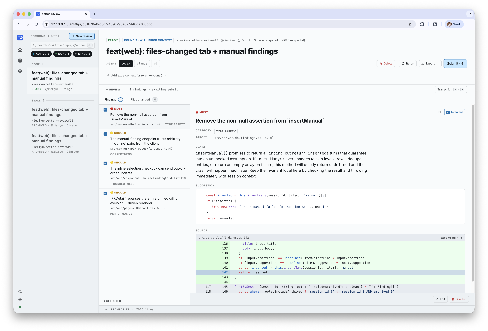

# better-review

> A local-first PR review helper. Drives `codex`, `claude`, or `pi` review agents under a browser UI, then ships findings to GitHub as inline comments via the `gh` CLI.

[简体中文](./README.zh-CN.md)

`better-review` runs entirely on your machine: a Node daemon, a React SPA, and a thin orchestration layer over the agent and `gh` CLIs. There is no cloud component, no auth layer, and no shared state — everything lives under `~/.better-review/`.

<p align="center">
  
</p>

## Highlights

- **Pick the right agent per review.** Swap between `codex`, `claude`, and `pi` from a single UI — no separate tools, no separate workflows. Set a default and override per session.
- **Agents read your real source.** Point at your local clone and the agent reviews a `git worktree` at the PR head — actual files, real callers, not just the diff. No clone? It still pulls the touched files at HEAD.
- **You stay in charge before anything ships.** Triage every finding, edit wording or severity, add your own, drop the ones that don't matter. Nothing reaches GitHub until you press Submit.
- **Reruns build on the last round.** Each rerun preserves the prior round as read-only history and feeds the previous review back to the agent, so it can extend past judgment instead of starting from scratch.
- **Two ways out: GitHub or a coding agent.** One click posts selected findings as inline comments via `gh`. Or skip the GitHub round-trip entirely and export the findings as Markdown / JSON to hand off to Claude Code / Codex / Cursor for fixing.
- **Bend the prompt to your project.** Layer a project-level `review.md` over a global one over the built-in rules — first hit wins, no forking, no merging.
- **Bilingual end to end.** The UI and the agent-facing prompts are both maintained in English and 简体中文; findings come back in the language you picked.
- **Local-first and inspectable.** Everything lives in `~/.better-review/` — SQLite for state, flat files for prompts, diffs, transcripts, and prep logs. No cloud, no telemetry, no auth.

## Prerequisites

| Tool                               | Version                   | Notes                                                                                                                                              |
| ---------------------------------- | ------------------------- | -------------------------------------------------------------------------------------------------------------------------------------------------- |
| [Node.js](https://nodejs.org)      | ≥ 20                      | Required by the daemon and the build.                                                                                                              |
| C/C++ toolchain                    | platform default          | Needed at install time to build `better-sqlite3` from source. macOS: Xcode Command Line Tools (`xcode-select --install`). Linux: `build-essential` + `python3`. Windows: `npm install --global windows-build-tools` (or install Visual Studio Build Tools manually). |
| [`gh` CLI](https://cli.github.com) | recent                    | Must be authenticated (`gh auth login`).                                                                                                           |
| Review agent CLI                   | at least one              | [`codex`](https://github.com/openai/codex), [`claude`](https://docs.anthropic.com/en/docs/claude-code), or `pi`. Must be on your `PATH`.           |
| Browser                            | Chrome / Firefox / Safari | UI runs at `http://127.0.0.1:<port>`.                                                                                                              |

## Install

```bash
npm install -g @xieziyu/better-review
```

Verify:

```bash
better-review --help
```

Or build from source if you want to hack on it:

```bash
git clone https://github.com/xieziyu/better-review.git
cd better-review
pnpm install
pnpm run build
npm install -g .         # or: pnpm link --global
```

If you'd rather not install globally, run `node dist/cli/index.js …` after `pnpm run build` — every `better-review …` invocation in this README has the same form.

## Quick start

```bash
better-review                                       # launch daemon + open UI
better-review https://github.com/owner/repo/pull/1  # also create a review and jump to it
better-review status                                # pid / port / startedAt
better-review stop                                  # graceful shutdown
better-review restart                               # stop + start (use after gh auth login)
```

The first run creates `~/.better-review/` (override with `BETTER_REVIEW_HOME`).

## Usage

### Create a review

Paste a GitHub PR URL on the home page (only `https://github.com/<owner>/<repo>/pull/<n>` is accepted) and press **Start review**. The form has three optional inputs you can layer on top:

- **Local repo path** — point at your existing clone (e.g. `~/code/owner/repo`). The daemon adds a `git worktree` at the PR head so the agent sees PR-merged source, not just the diff. Auto-filled from history when the URL matches a previously-used path; the **Browse** button opens a native folder picker on platforms that support one. Without a pinned clone, the daemon falls back to a partial `gh api`-backed snapshot of diff-touched files at HEAD.
- **Extra context** — a per-review prompt addendum (spec snippets, design intent, etc.). Affects only this session; doesn't touch `review.md`. Editable later from the PR detail page and carried into reruns unless overridden.
- **Agent** — segmented selector to override `defaultAgent` for this session. Disabled buttons mean the CLI isn't on `PATH`.

You can also pass the URL directly on the CLI — it opens the UI at that PR with the default settings.

### Triage findings

The PR detail page opens on the **Files changed** tab — a hierarchical, path-compressed tree of the touched files with the unified diff on the right and finding cards inlined at the relevant hunks. The flat **Findings** tab is one click away when you want to step through the full list with the Inspector pane open.

Each finding renders with:

- a checkbox controlling whether it ships,
- a severity tag (`MUST` / `SHOULD` / `NIT`) and a free-form `category` label,
- the body in markdown with an inline diff slice when the finding has `file:line`,
- edit and delete buttons (`⌘↵` saves; delete is local-only and doesn't touch GitHub).

PR-wide findings (no `file`) live in a separate group. You can also **add a manual finding** yourself from the Files tab; it submits to GitHub like any other. While the agent is still streaming, a toast notifies you when a new finding lands in a file you're not currently viewing — click it to jump.

Multi-tab edits sync over SSE.

### Rerun a review

Every rerun archives the previous round; the live page shows a `Round 2`, `Round 3`, … tag and the prior runs become read-only history (`/pr/<old-id>` still loads, just without Submit/Edit). Reruns also feed the previous review back to the agent: the prior review body, your prior inline comments, plus the PR-conversation thread are inlined into the prompt under a `PRIOR REVIEW` section, so the agent can build on past judgment instead of starting from scratch. Force-pushes are detected and called out explicitly. Cancel a running review with the **Stop** button (sends SIGTERM, then SIGKILL on timeout).

### Submit to GitHub

The **Submit** drawer is two steps:

1. **Review** — preview which selected findings become inline comments and which fall back to the review body (off-diff or PR-wide), pick a review event (`COMMENT` / `REQUEST_CHANGES` / `APPROVE`), and edit the review body. The body is auto-populated from PR-wide findings unless you override it. Findings that duplicate a comment you already posted in a prior submission are flagged and skipped server-side.
2. **Confirm** — final summary, then submit (`⌘⏎`). The daemon POSTs to `gh api repos/<owner>/<repo>/pulls/<n>/reviews` and shows the GitHub URL inline.

There are no automatic retries; failures surface in the banner and the submissions table.

### Local export (hand off to a coding agent)

Don't want to go through the GitHub review flow — just want to hand the findings to a local coding agent (Claude Code / Codex / Cursor) for fixing? The detail-page toolbar's **Export ▾** button (`⌘E` / `Ctrl+E`) pops a small panel:

- **Scope** — defaults to selected findings (matches Submit); switch to All for every non-archived finding. With nothing selected it auto-switches to All.
- **Format** — `Markdown` groups by file with severity emoji + `suggestion` code blocks, ready to paste into a coding agent; `JSON` is a clean `Finding[]` (internal fields like `dbId` / `sessionId` stripped), suitable for scripts.
- **Copy / Download** — clipboard or a file named `findings-pr-<n>-<scope>.<ext>`. Pure client-side: doesn't call `gh`, doesn't touch GitHub, doesn't mutate finding state, doesn't count as a submission.

### Customise the review prompt

The prompt is split into two layers:

- **Framework** (read-only, shipped with the package, in `prompts/framework.{en,zh-CN}.md`): reviewer persona, placeholder positions, the **severity rubric** (`must` / `should` / `nit` semantics), output schema, `suggestion` anchoring rules, and the `{{#SOURCE:…}}` / `{{#EXTRA_NOTES}}` / `{{#PRIOR_REVIEW}}` blocks. These are hard contracts for the findings parser and the submit pipeline — your `review.md` cannot override them.
- **Rules** (overridable, `prompts/builtin-rules.{en,zh-CN}.md`): the review checklist, `category` label set, and any domain-specific guidance you want the agent to follow. Resolved in this order — first hit wins:

  ```
  <pinned-repo>/.better-review/review.md     # project (the local repo pinned for the review)
  ~/.better-review/review.md                 # global
  prompts/builtin-rules.<lang>.md            # built-in default, language-paired
  ```

  The project tier is keyed to the local repo you pin for a review — not the daemon's working directory. If a review runs without a pinned local repo, the project tier is skipped.

Edit either scope from the **Prompt** link in the top bar (`Effective` / `Framework` / `Project` / `Global` tabs; `⌘S` saves). The `Project` tab has a repo selector at the top — pick the local repo whose `.better-review/review.md` you want to edit. Saving only affects future reviews. To replay existing sessions with the new rules, use **Apply to current session** in the prompt editor (it opens a picker so you can select which sessions to rerun) or **Rerun** on a single PR detail page.

Daemon configuration (language, default agent, watchdog timeout, GC retention, port, concurrency) lives under the **Settings** link in the top bar; the **status dot** next to it shows daemon and CLI health at a glance — click for a popover with pid / port / uptime / agent + `gh` paths.

### Language

Both the UI and the agent-facing prompts are bilingual (English + 简体中文). The language picker in the top bar hot-applies; it also drives which built-in prompt variant is fed to the agent, so findings come back in the matching language. First boot picks the language from `LANG` / `LC_ALL` / OS locale.

## Configuration

Layout under `~/.better-review/`:

```
config.json               # optional; defaults are fine
server.json               # daemon liveness: { pid, port, startedAt }
state.db                  # SQLite — sessions / findings / submissions / submission_comments
daemon.log                # structured server logs
review.md                 # global rule overrides (optional)
codex-home/               # isolated CODEX_HOME used when running codex (see below)
sessions/pr-<...>/        # per-review workdir: diff.cache, findings.json, agent.log, prompt.txt, prep.log
```

**Why `codex-home/`?** The codex CLI records a `[projects."<cwd>"] trust_level = "trusted"` entry into its `config.toml` every time it runs in a new directory. better-review uses a fresh per-session workdir, which would otherwise grow your real `~/.codex/config.toml` by one block per review. To avoid that, the daemon points codex at `~/.better-review/codex-home/` via the `CODEX_HOME` environment variable — your real `~/.codex` stays untouched. The directory is seeded from your real `~/.codex/config.toml` (minus `[projects.*]` sections); `auth.json` is symlinked when present, so file-based credentials carry over (macOS keychain users need no extra setup).

`config.json` keys (all optional). The **Settings** page edits the same file; most keys hot-reload, the two flagged below need a daemon restart.

| Key                    | Default                | Meaning                                                                                                                |
| ---------------------- | ---------------------- | ---------------------------------------------------------------------------------------------------------------------- |
| `port`                 | `0` (random)           | Set to a fixed port if you want a stable URL. _(restart required)_                                                     |
| `maxConcurrentReviews` | `4`                    | Cap on parallel agent processes; the rest queue. _(restart required)_                                                  |
| `stallMinutes`         | `3`                    | Watchdog kills an agent that emits no stdout for this long.                                                            |
| `defaultAgent`         | `"codex"`              | `"codex"` / `"claude"` / `"pi"`. If unset and the configured CLI is missing, falls back to the first installed agent.  |
| `perPRGCDays`          | `7`                    | Garbage-collect per-PR workdirs older than this many days; `0` disables GC.                                            |
| `language`             | auto (`en` / `zh-CN`)  | UI + built-in prompt language. Auto-detected from `LANG` / `LC_ALL` / OS locale on first boot.                         |

## Development

```bash
pnpm install
pnpm run dev:server    # tsx watch on the daemon
pnpm run dev:web       # Vite dev server, proxies /api → daemon
pnpm run build         # tsc + vite build + scripts/copy-assets.mjs
pnpm run test          # vitest (server + cli + shared)
pnpm run test:web      # vitest jsdom (web components)
pnpm run e2e           # Playwright happy path
pnpm run lint
pnpm run format        # writes; `format:check` for CI
```

### Guiding principles

- **Conventional Commits**, lowercase imperative — `feat(scope): …`, `fix(scope): …`. Match existing scopes (`cli`, `server`, `engine`, `web`, `prompts`).
- **TDD for routes and engine code**: failing test → implementation → commit.
- **No mocks for `better-sqlite3`, the agent CLIs, or `gh`.** Tests open a real SQLite file at a temp path, and shell shims under `tests/fixtures/` (`fake-codex.sh`, `fake-claude.sh`, `fake-gh.sh`) stand in for the external tools.
- **Strict TS** — `noUncheckedIndexedAccess` and `exactOptionalPropertyTypes` are on. Narrow indexed access; pass `undefined` explicitly for optional fields.
- **Don't add `.js` to TypeScript imports.** `scripts/copy-assets.mjs` rewrites compiled output post-build; sources stay extensionless.
- **Prompt convention** — every built-in prompt has paired `<name>.en.md` and `<name>.zh-CN.md` variants. Keep them in sync (same structure, same placeholders). Chinese variants follow "Chinese prose, English code identifiers": file paths, symbol names, CLI flags, category strings (`Scope`, `Correctness`, …), and severity values (`must` / `should` / `nit`) stay English.

For deeper architecture and design rationale, see [`CLAUDE.md`](./CLAUDE.md), [`DESIGN.md`](./DESIGN.md), and [`PRODUCT.md`](./PRODUCT.md).

## FAQ

**Port already in use?** Leave `port: 0` in `config.json` so the OS picks a free one, or set a stable port and stop whatever else is bound to it.

**Status dot turns red, popover shows `gh: not authed`.** The daemon inherits the env from the shell that started it. Run `gh auth login` and then `better-review restart`.

**Agent runs forever and nothing happens.** Default watchdog is 3 minutes of silent stdout; raise `stallMinutes` if your reviews legitimately go quiet for longer. After a kill, the session goes `failed` — click **Rerun**.

**I edited the prompt — does it re-run my open PRs?** No. Existing findings stay put; click **Rerun** on the PR detail page (or **Apply to current session** in the prompt editor) to re-execute with the current rules.

**My configured default agent isn't installed.** If you never explicitly set `defaultAgent` in `config.json`, the daemon auto-switches to the first installed CLI from `codex` → `claude` → `pi`. If you _did_ set it explicitly, the status dot goes red and the home page disables that button until you install the CLI or change the setting.

## License

Copyright (C) 2026 xieziyu

better-review is free software, licensed under the **GNU General Public License v3.0 or later** — see [LICENSE](./LICENSE).
